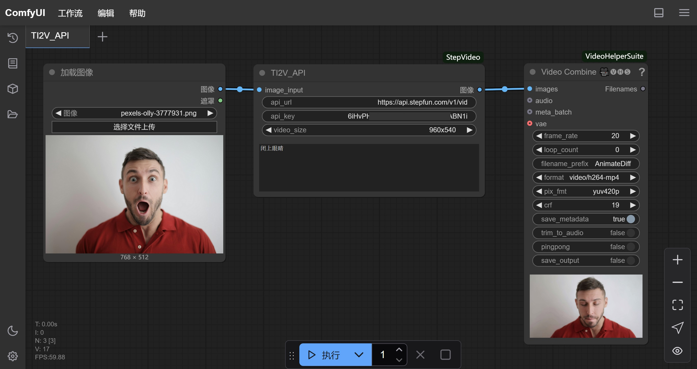

# ComfyUI-StepVideo
This repository contains ComfyUI custom nodes for StepVideo.

## TI2V
### Workflow
[TI2V.json](workflow/TI2V.json)


### Model Weights
Download the model weights from [this link](https://huggingface.co/stepfun-ai/stepvideo-ti2v).

### Install
1. Install [Step-Video-TI2V](https://github.com/stepfun-ai/Step-Video-TI2V)

2. Install ComfyUI custom nodes for StepVideo
```bash
cd ComfyUI/custom_nodes
git clone https://github.com/stepfun-ai/ComfyUI-StepVideo.git 
```

### Inference
1. Launch Step-Video-TI2V remote_server
```bash
cd Step-Video-TI2V
python api/call_remote_server.py --model_dir where_you_download_dir &  ## We assume you have more than 4 GPUs available. This command will return the URL for both the caption API and the VAE API. Please use the returned URL as "remote_server_url" parameter in the "TI2V" node.
```

2. Launch ComfyUI
```bash
cd ComfyUI
python main.py
```

## TI2V_API
### Workflow
[TI2V.json](workflow/TI2V_API.json)


### Usage
api_url: https://api.stepfun.com/v1/video/generations
api_key: get api_key from https://platform.stepfun.com

## Todo
- [x] TI2V node
- [x] TI2V_API node
- [ ] T2V node
- [ ] T2V_API node