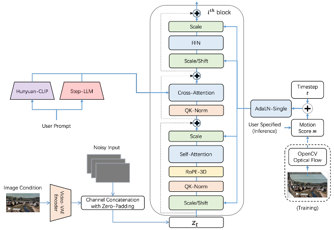
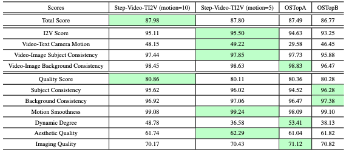
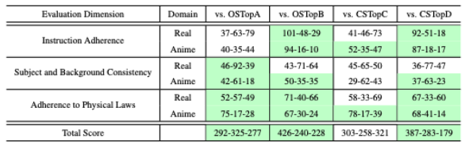

<p align="center">
  
</p>
<div align="center">
  <a href="https://yuewen.cn/videos"></a> &ensp;
  <a href="https://arxiv.org/abs/2502.10248"></a> &ensp;
  <a href="https://x.com/StepFun_ai"></a> &ensp;
</div>

<div align="center">
  <a href="https://huggingface.co/stepfun-ai/stepvideo-ti2v"></a> &ensp;
</div>

## 🔥🔥🔥 News!!
* Mar 17, 2025: 👋 We release the inference code and model weights of Step-Video-Ti2V. [Download](https://huggingface.co/stepfun-ai/stepvideo-ti2v)
* Mar 17, 2025: 🎉 We have made our technical report available as open source. [Read](https://arxiv.org/abs/2502.10248)


## Motion Control

<table border="0" style="width: 100%; text-align: center; margin-top: 1px;">
  <tr>
    <td><video src="https://github.com/user-attachments/assets/3c6a5c8d-ada4-484f-8f3d-f2a99ef18a4b" width="30%" controls autoplay loop muted></video></td>
    <td><video src="https://github.com/user-attachments/assets/90c608d9-b3cf-40fa-b4ee-21b682c840ae" width="30%" controls autoplay loop muted></video></td>
    <td><video src="https://github.com/user-attachments/assets/e58d3a6b-0076-4587-aac5-6911ba4c776d" width="30%" controls autoplay loop muted></video></td>
  </tr>
</table>

## Motion Amplitude Control

<table border="0" style="width: 100%; text-align: center; margin-top: 10px;">
  <tr>
    <th style="width: 33%;">Motion = 2</th>
    <th style="width: 33%;">Motion = 5</th>
    <th style="width: 33%;">Motion = 10</th>
  </tr>
  <tr>
    <td><video src="https://github.com/user-attachments/assets/0d6b1813-2bf0-462a-8ad4-c0583d83afc5" width="33%" controls autoplay loop muted></video></td>
    <td><video src="https://github.com/user-attachments/assets/33699654-93cc-4205-8a47-93ece4282f72" width="33%" controls autoplay loop muted></video></td>
    <td><video src="https://github.com/user-attachments/assets/52d73eb5-2c68-4de3-9019-516243804b2c" width="33%" controls autoplay loop muted></video></td>
  </tr>
</table>

<table border="0" style="width: 100%; text-align: center; margin-top: 10px;">
  <tr>
    <th style="width: 33%;">Motion = 2</th>
    <th style="width: 33%;">Motion = 5</th>
    <th style="width: 33%;">Motion = 20</th>
  </tr>
  <tr>
    <td><video src="https://github.com/user-attachments/assets/31c48385-fe83-4961-bd42-7bd2b1edeb19" width="33%" controls autoplay loop muted></video></td>
    <td><video src="https://github.com/user-attachments/assets/913a407e-55ca-4a33-bafe-bd5e38eec5f5" width="33%" controls autoplay loop muted></video></td>
    <td><video src="https://github.com/user-attachments/assets/119a3673-014f-4772-b846-718307a4a412" width="33%" controls autoplay loop muted></video></td>
  </tr>
</table>

🎯 Tips 
The default motion_score = 5 is suitable for general use. If you need more stability, set motion_score = 2, though it may be less responsive to certain movements. For greater movement flexibility, you can use motion_score = 10 or motion_score = 20 to enable more intense actions. Feel free to customize the motion_score based on your creative needs to fit different use cases.

## Camera Control

<table border="0" style="width: 100%; text-align: center; margin-top: 1px;">
  <tr>
    <th style="width: 33%;">镜头环绕</th>
    <th style="width: 33%;">镜头推进</th>
    <th style="width: 33%;">镜头拉远</th>
  </tr>
  <tr>
    <td><video src="https://github.com/user-attachments/assets/257847bc-5967-45ba-a649-505859476aad" height="30%" controls autoplay loop muted></video></td>
    <td><video src="https://github.com/user-attachments/assets/d310502a-4f7e-4a78-882f-95c46b4dfe67" height="30%" controls autoplay loop muted></video></td>
    <td><video src="https://github.com/user-attachments/assets/f6426fc7-2a18-474c-9766-fc8ae8d8d40d" height="30%" controls autoplay loop muted></video></td>
  </tr>
</table>

<table border="0" style="width: 100%; text-align: center; margin-top: 1px;">
  <tr>
    <th style="width: 33%;">镜头固定</th>
    <th style="width: 33%;">镜头左移</th>
    <th style="width: 33%;">镜头右摇</th>
  </tr>
  <tr>
    <td><video src="https://github.com/user-attachments/assets/f78f76a0-afe1-41b1-9914-f2f508c6ea50" width="30%" controls autoplay loop muted></video></td>
    <td><video src="https://github.com/user-attachments/assets/3894ec0f-d483-41fe-8331-68b6e5bf6544" width="30%" controls autoplay loop muted></video></td>
    <td><video src="https://github.com/user-attachments/assets/9de3aa20-c797-4dac-bef1-ee064ed96ed4" width="30%" controls autoplay loop muted></video></td>
  </tr>
</table>

🎥 Camera Motion Tips
Fixed Camera
Pan (Up/Down/Left/Right)
Tilt (Up/Down/Left/Right)
Zoom In / Zoom Out
Dolly In / Dolly Out
Camera Rotation
Tracking Shot (Follow xxx)
Orbit Shot (Circle Around xxx)
Rack Focus (Focus Shift)
Camera Shake
High-Angle Dolly In / Dolly Out

🎬 Advanced Movements
Dolly Zoom (Hitchcock Effect)
Grammy-Style Motion

<table border="0" style="width: 100%; text-align: center; margin-top: 1px;">
  <tr>
    <th style="width: 50%;">摄像机从下到中顺时针绕人物移动，镜头推远，1秒后慢镜头拍摄，人物从斜侧背对镜头，转过身正面面对镜头</th>
    <th style="width: 50%;">摄像机从下到中顺时针绕人物90度移动，镜头拉近，1秒后慢镜头拍摄，人物从背对镜头，身体逆时针旋转 180 度最终正对镜头</th>
  </tr>
  <tr>
    <td><video src="https://github.com/user-attachments/assets/e2931131-e159-44ea-91a8-82bfe7886447" height="10%" width="50%" controls autoplay loop muted></video></td>
    <td><video src="https://github.com/user-attachments/assets/6e4b893a-51bf-49b0-8335-13674da3162b" height="10%" width="50%" controls autoplay loop muted></video></td>
  </tr>
</table>


🔧 Motion Score Considerations
Certain camera movements, especially tracking shots, orbit shots, and complex motion effects, work significantly better with motion_score = 5 or 10 rather than motion_score = 2. Choosing the right setting can greatly enhance motion smoothness and accuracy.
## Visual Effects

<table border="0" style="width: 100%; text-align: center; margin-top: 1px;">
  <tr>
    <th style="width: 33%;">机器人变身特效</th>
    <th style="width: 33%;">机器人变身特效</th>
    <th style="width: 33%;">机器人变身特效</th>
  </tr>
  <tr>
    <td><video src="https://github.com/user-attachments/assets/8fc6cc28-802c-4eff-bb18-6d512386d1f5" height="30%" controls autoplay loop muted></video></td>
    <td><video src="https://github.com/user-attachments/assets/a6e4c817-3847-4ece-8b14-c57c4f666ba5" height="30%" controls autoplay loop muted></video></td>
    <td><video src="https://github.com/user-attachments/assets/3cc15523-4dbe-4a39-9a1f-71fd2aeebf98" height="30%" controls autoplay loop muted></video></td>
  </tr>
</table>

<table border="0" style="width: 100%; text-align: center; margin-top: 1px;">
  <tr>
    <th style="width: 33%;">毒液变身特效</th>
    <th style="width: 33%;">机器人变身特效</th>
    <th style="width: 33%;">毒液变身特效</th>
  </tr>
  <tr>
    <td><video src="https://github.com/user-attachments/assets/b2fbc737-b6b5-480a-b747-09ee58058a05" height="30%" controls autoplay loop muted></video></td>
    <td><video src="https://github.com/user-attachments/assets/ba19d48e-0e99-4dd6-8efb-f9c7f21372a6" height="30%" controls autoplay loop muted></video></td>
    <td><video src="https://github.com/user-attachments/assets/b3e27eda-8127-4680-8da1-99fa0281335d" height="30%" controls autoplay loop muted></video></td>
  </tr>
</table>


## Table of Contents

1. [Introduction](#1-introduction)
2. [Model Summary](#2-model-summary)
3. [Model Download](#3-model-download)
4. [Model Usage](#4-model-usage)
5. [Benchmark](#5-benchmark)
6. [Online Engine](#6-online-engine)
7. [Citation](#7-citation)
8. [Acknowledgement](#8-ackownledgement)


## 1. Introduction
We present Step-Video-TI2V, a state-of-the-art text-driven image-to-video generation model with 30B parameters, capable of generating videos up to 102 frames
based on both text and image inputs. We build Step-Video-TI2V-Eval as a new benchmark for the text-driven image-to-video task and compare Step-Video-TI2V
with open-source and commercial TI2V engines using this dataset. Experimental results demonstrate the state-of-the-art performance of Step-Video-TI2V in the
image-to-video generation task. Both Step-Video-TI2V and Step-Video-TI2V-Eval are available.

## 2. Model Summary
Step-Video-TI2V based on Step-Video-T2V. To incorporate the image condition as the first frame of the generated video, we encode it into latent representations using Step-Video- T2V’s Video-VAE and concatenate them along the channel dimension of the video latent. Additionally, we introduce a motion score condition, enabling users to control the dynamic level of the video generated from the image condition. Figure 1 shows an overview of our framework, highlighting these two modifications to the pre-trained T2V model. 

<p align="center">
  
</p>

## 3. Model Download
| Models   | 🤗Huggingface    |  🤖Modelscope |
|:-------:|:-------:|:-------:|
| Step-Video-T2V | [download](https://huggingface.co/stepfun-ai/stepvideo-ti2v) | 


## 4. Model Usage

### 📜 4.1  Dependencies and Installation

```bash
git clone https://github.com/stepfun-ai/Step-Video-TI2V.git
conda create -n stepvideo python=3.10
conda activate stepvideo

cd Step-Video-TI2V
pip install -e .
```

###  🚀 4.2. Inference Scripts
```bash
python api/call_remote_server.py --model_dir where_you_download_dir &  ## We assume you have more than 4 GPUs available. This command will return the URL for both the caption API and the VAE API. Please use the returned URL in the following command.

parallel=4  # or parallel=8
url='127.0.0.1'
model_dir=where_you_download_dir

torchrun --nproc_per_node $parallel run_parallel.py --model_dir $model_dir --vae_url $url --caption_url $url  --ulysses_degree  $parallel --prompt "笑起来" --first_image_path ./assets/demo.png --infer_steps 50  --cfg_scale 9.0 --time_shift 13.0 --motion_score 5.0
```

We list some more useful configurations for easy usage:

|        Argument        |  Default  |                Description                |
|:----------------------:|:---------:|:-----------------------------------------:|
|       `--model_dir`       |   None    |   The model checkpoint for video generation    |
|     `--prompt`     | “笑起来”  |      The text prompt for I2V generation      |
|    `--first_image_path`    |    ./assets/demo.png    |     The reference image path for I2V task.     |
|    `--infer_steps`     |    50     |     The number of steps for sampling      |
| `--cfg_scale` |    9.0    |    Embedded  Classifier free guidance scale       |
|     `--time_shift`     |    7.0    | Shift factor for flow matching schedulers. |
|     `--motion_score`   |    5.0  | Score to control the motion level of the video. |
|        `--seed`        |     None  |   The random seed for generating video, if None, we init a random seed    |
|  `--use-cpu-offload`   |   False   |    Use CPU offload for the model load to save more memory, necessary for high-res video generation    |
|     `--save-path`      | ./results |     Path to save the generated video      |


## 5. Benchmark
We first evaluated on VBench-I2V is a comprehensive benchmark suite that deconstructs “video generation
quality” into specific, hierarchical, and disentangled dimensions, each with tailored prompts and evaluation methods. We utilize the VBench-I2V benchmark to assess the performance of Step-Video-
TI2V alongside other TI2V models.

<p align="center">
  
</p>

We are releasing [Step-Video-Ti2V Eval](https://github.com/stepfun-ai/Step-Video-T2V/blob/main/benchmark/Step-Video-TI2V-Eval) , a new benchmark designed for the text-driven image-to-video
generation task. The dataset comprises 178 real-world and 120 anime-style prompt-image pairs, ensuring broad coverage of diverse user scenarios. To achieve comprehensive representation, we
developed a fine-grained schema for data collection in both categories. We compare Step-Video-TI2V with two recently released open-source TI2V models, OSTopA and
OSTopB, as well as two close-source commercial TI2V models, CSTopC and CSTopD. All these four models originate from China. Generally, Step-Video-TI2V achieves state-of-the-art performance on the total score across the
three evaluation dimensions in Step-Video-TI2V-Eval, either outperforming or matching leading open-source and closed-source commercial TI2V models.

<p align="center">
  
</p>


## 6. Online Engine
The online version of Step-Video-T2V is available on [跃问视频](https://yuewen.cn/videos), where you can also explore some impressive examples.

## 7. Citation
```
@misc{ma2025stepvideot2vtechnicalreportpractice,
      title={Step-Video-Ti2V Technical Report: The Practice, Challenges, and Future of Video Foundation Model}, 
      author={Guoqing Ma and Haoyang Huang and Kun Yan and Liangyu Chen and Nan Duan and Shengming Yin and Changyi Wan and Ranchen Ming and Xiaoniu Song and Xing Chen and Yu Zhou and Deshan Sun and Deyu Zhou and Jian Zhou and Kaijun Tan and Kang An and Mei Chen and Wei Ji and Qiling Wu and Wen Sun and Xin Han and Yanan Wei and Zheng Ge and Aojie Li and Bin Wang and Bizhu Huang and Bo Wang and Brian Li and Changxing Miao and Chen Xu and Chenfei Wu and Chenguang Yu and Dapeng Shi and Dingyuan Hu and Enle Liu and Gang Yu and Ge Yang and Guanzhe Huang and Gulin Yan and Haiyang Feng and Hao Nie and Haonan Jia and Hanpeng Hu and Hanqi Chen and Haolong Yan and Heng Wang and Hongcheng Guo and Huilin Xiong and Huixin Xiong and Jiahao Gong and Jianchang Wu and Jiaoren Wu and Jie Wu and Jie Yang and Jiashuai Liu and Jiashuo Li and Jingyang Zhang and Junjing Guo and Junzhe Lin and Kaixiang Li and Lei Liu and Lei Xia and Liang Zhao and Liguo Tan and Liwen Huang and Liying Shi and Ming Li and Mingliang Li and Muhua Cheng and Na Wang and Qiaohui Chen and Qinglin He and Qiuyan Liang and Quan Sun and Ran Sun and Rui Wang and Shaoliang Pang and Shiliang Yang and Sitong Liu and Siqi Liu and Shuli Gao and Tiancheng Cao and Tianyu Wang and Weipeng Ming and Wenqing He and Xu Zhao and Xuelin Zhang and Xianfang Zeng and Xiaojia Liu and Xuan Yang and Yaqi Dai and Yanbo Yu and Yang Li and Yineng Deng and Yingming Wang and Yilei Wang and Yuanwei Lu and Yu Chen and Yu Luo and Yuchu Luo and Yuhe Yin and Yuheng Feng and Yuxiang Yang and Zecheng Tang and Zekai Zhang and Zidong Yang and Binxing Jiao and Jiansheng Chen and Jing Li and Shuchang Zhou and Xiangyu Zhang and Xinhao Zhang and Yibo Zhu and Heung-Yeung Shum and Daxin Jiang},
      year={2025},
      eprint={2502.10248},
      archivePrefix={arXiv},
      primaryClass={cs.CV},
      url={https://arxiv.org/abs/2502.10248}, 
}
```

